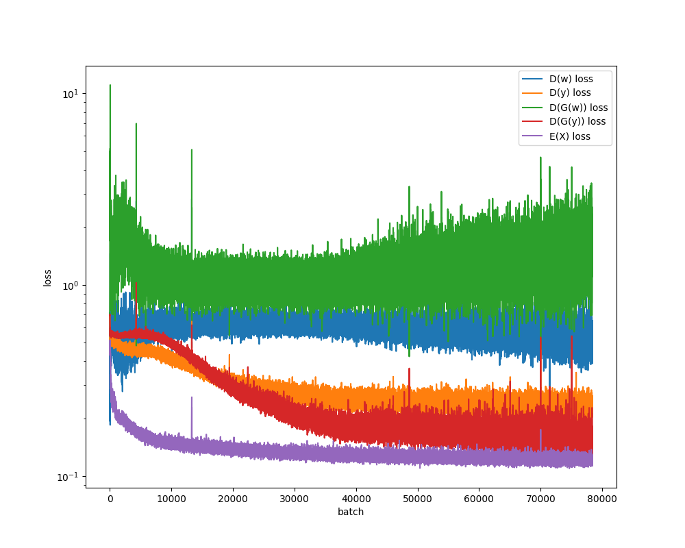
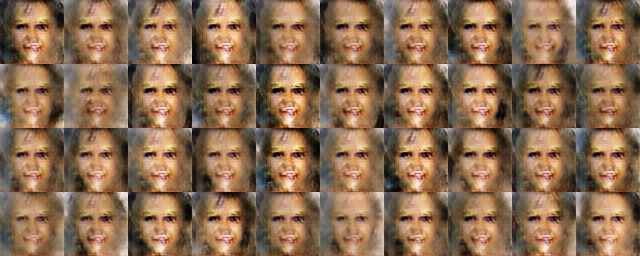
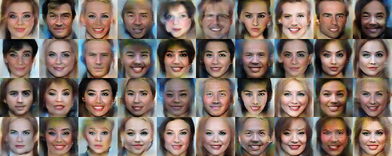

# CelebA-AE-AC-GAN

An auto-encoder + auxiliary classifier GAN model is explored in this project, to produce artificial, realistic human faces. Training data is based on the CelebA dataset, with some pre-processing steps.

The presented work is based and expended on a similar study for digit and letter generation based on (Extended) MNIST datasets ([link](https://github.com/markusmeingast/MNIST-GAN)). Notable expansions are, switching to 3 color channels, a base resolution of 64x64 images, multi-class-multi-label classification and one-sided label-smoothing.

## Data Preprocessing

The [CelebA Dataset](http://mmlab.ie.cuhk.edu.hk/projects/CelebA.html) consists of over 200.000 images of celebrities. In order to
reduce computational expenses, the dataset was reduced to about 1/3 samples. Original images are of a shape 218x178. For the work presented here, the images are cropped to a window with upper left corner at
59px, 24px and a width an height of 128 pixels each. Finally each image is down-sampled to a size of 64x64.

## Nomenclature

* **X**:     images
* **y**:     one-hot-vector classification
* **z**:     latent noise vector
* **w**:     real/fake classification

## Assumptions

* Real samples get label 1, fake get label 0
* Label smoothing (optional for discriminator training)
* Latent noise vector in interval [0,1]
* Images normalized to [-1,1] (tanh)
* GaussianNoise is added to discriminator input (optional)
* binary-crossentropy is used for binary classification, i.e. real or fake images
* binary-crossentropy is used for one-hot encoded classification of images (multi-class-multi-label)
* autoencoder uses MAE (MSE creates slightly blurry images)
* Generator, discriminator and encoder to use LeakyReLU and Dropout (BatchNormalization causes issues in convergence and mode collapse). This is likely the largest lever to improve image quality in future developments.
* Class labels are scaled to binary 0/1 from original dataset -1/1. (Both approaches were tested with no notable improvement. -1/1 may make sense when scaling to higher fidelity)
* Learning rate for autoencoder seems optimal at about 25% of the other networks

## AE-AC-GAN Model

A classical GAN model learns to generate images that look realistic by playing
two specialized neural networks against each other. A generator takes a latent
noise vector (with no explicit meaning) as input and tries to produce a
realistic image. The second neural network tries to discriminate if a given
image is from the real dataset, or produced by the generator. In theory both
networks, by trying to outsmart each other, continuously improve them-selves.

The classical GAN network would produce a random image that is indistinguishable
from images of the original dataset. In order to allow for a control of the output,
a auxiliary classifier is implemented: The generator takes the latent noise vector,
as well as a intended class (one-hot-encoded) input, and the discriminator tries
to determine the "fakeness" of the image, as well as it's class. Therefore two
loss functions are supplied for the discriminator output, that the model is
trained on.

A major hurdle in GAN structures is mode-collapse. Under certain conditions, the
generator may learn to produce an image output that is independent of the latent
noise vector (e.g. the weights of the first layer are 0). The output image, although
realistic, shows no variations, effectively producing the same image over and over.
In order to circumvent this collapse, multiple architectures have been introduced.
For this project specifically, a auto-encoder type network is stacked onto the
Auxiliary-Classifier GAN.

In the model shown below, the generator is trained from both sides: on one side
the GAN as described above is trained, on the other the auto-encoder tries to
produce a mirror-perfect representation of the input image. The generator is
thereby forced to use the reduced space vector (latent noise vector for GAN),
effectively suppressing full mode collapse.

Training is therefore defined in 3 steps, per batch: discriminator training on real and fake data (orange), generator training on latent noise vector and class where discriminator is frozen (green) and auto-encoder training on real images (red).

Below are the current model configurations:

### Encoder

    Model: "encoder"
    __________________________________________________________________________________________________
    Layer (type)                    Output Shape         Param #     Connected to                     
    ==================================================================================================
    input_1 (InputLayer)            [(None, 64, 64, 3)]  0                                            
    __________________________________________________________________________________________________
    conv2d (Conv2D)                 (None, 32, 32, 32)   1568        input_1[0][0]                    
    __________________________________________________________________________________________________
    leaky_re_lu (LeakyReLU)         (None, 32, 32, 32)   0           conv2d[0][0]                     
    __________________________________________________________________________________________________
    conv2d_1 (Conv2D)               (None, 16, 16, 64)   32832       leaky_re_lu[0][0]                
    __________________________________________________________________________________________________
    leaky_re_lu_1 (LeakyReLU)       (None, 16, 16, 64)   0           conv2d_1[0][0]                   
    __________________________________________________________________________________________________
    conv2d_2 (Conv2D)               (None, 8, 8, 128)    131200      leaky_re_lu_1[0][0]              
    __________________________________________________________________________________________________
    leaky_re_lu_2 (LeakyReLU)       (None, 8, 8, 128)    0           conv2d_2[0][0]                   
    __________________________________________________________________________________________________
    flatten (Flatten)               (None, 8192)         0           leaky_re_lu_2[0][0]              
    __________________________________________________________________________________________________
    dense (Dense)                   (None, 128)          1048704     flatten[0][0]                    
    __________________________________________________________________________________________________
    leaky_re_lu_3 (LeakyReLU)       (None, 128)          0           dense[0][0]                      
    __________________________________________________________________________________________________
    dense_1 (Dense)                 (None, 40)           5160        leaky_re_lu_3[0][0]              
    __________________________________________________________________________________________________
    dense_2 (Dense)                 (None, 200)          25800       leaky_re_lu_3[0][0]              
    ==================================================================================================
    Total params: 1,245,264
    Trainable params: 1,245,264
    Non-trainable params: 0
    __________________________________________________________________________________________________

### Generator

    Model: "generator"
    __________________________________________________________________________________________________
    Layer (type)                    Output Shape         Param #     Connected to                     
    ==================================================================================================
    input_2 (InputLayer)            [(None, 40)]         0                                            
    __________________________________________________________________________________________________
    input_3 (InputLayer)            [(None, 200)]        0                                            
    __________________________________________________________________________________________________
    concatenate (Concatenate)       (None, 240)          0           input_2[0][0]                    
                                                                     input_3[0][0]                    
    __________________________________________________________________________________________________
    dense_3 (Dense)                 (None, 8192)         1974272     concatenate[0][0]                
    __________________________________________________________________________________________________
    leaky_re_lu_4 (LeakyReLU)       (None, 8192)         0           dense_3[0][0]                    
    __________________________________________________________________________________________________
    reshape (Reshape)               (None, 8, 8, 128)    0           leaky_re_lu_4[0][0]              
    __________________________________________________________________________________________________
    conv2d_transpose (Conv2DTranspo (None, 16, 16, 128)  262272      reshape[0][0]                    
    __________________________________________________________________________________________________
    leaky_re_lu_5 (LeakyReLU)       (None, 16, 16, 128)  0           conv2d_transpose[0][0]           
    __________________________________________________________________________________________________
    conv2d_transpose_1 (Conv2DTrans (None, 32, 32, 64)   131136      leaky_re_lu_5[0][0]              
    __________________________________________________________________________________________________
    leaky_re_lu_6 (LeakyReLU)       (None, 32, 32, 64)   0           conv2d_transpose_1[0][0]         
    __________________________________________________________________________________________________
    conv2d_transpose_2 (Conv2DTrans (None, 64, 64, 32)   32800       leaky_re_lu_6[0][0]              
    __________________________________________________________________________________________________
    leaky_re_lu_7 (LeakyReLU)       (None, 64, 64, 32)   0           conv2d_transpose_2[0][0]         
    __________________________________________________________________________________________________
    conv2d_3 (Conv2D)               (None, 64, 64, 3)    6147        leaky_re_lu_7[0][0]              
    ==================================================================================================
    Total params: 2,406,627
    Trainable params: 2,406,627
    Non-trainable params: 0
    __________________________________________________________________________________________________

### Discriminator

    Model: "discriminator"
    __________________________________________________________________________________________________
    Layer (type)                    Output Shape         Param #     Connected to                     
    ==================================================================================================
    input_4 (InputLayer)            [(None, 64, 64, 3)]  0                                            
    __________________________________________________________________________________________________
    conv2d_4 (Conv2D)               (None, 32, 32, 32)   1568        input_4[0][0]                    
    __________________________________________________________________________________________________
    leaky_re_lu_8 (LeakyReLU)       (None, 32, 32, 32)   0           conv2d_4[0][0]                   
    __________________________________________________________________________________________________
    conv2d_5 (Conv2D)               (None, 16, 16, 64)   32832       leaky_re_lu_8[0][0]              
    __________________________________________________________________________________________________
    leaky_re_lu_9 (LeakyReLU)       (None, 16, 16, 64)   0           conv2d_5[0][0]                   
    __________________________________________________________________________________________________
    conv2d_6 (Conv2D)               (None, 8, 8, 128)    131200      leaky_re_lu_9[0][0]              
    __________________________________________________________________________________________________
    leaky_re_lu_10 (LeakyReLU)      (None, 8, 8, 128)    0           conv2d_6[0][0]                   
    __________________________________________________________________________________________________
    flatten_1 (Flatten)             (None, 8192)         0           leaky_re_lu_10[0][0]             
    __________________________________________________________________________________________________
    dense_4 (Dense)                 (None, 128)          1048704     flatten_1[0][0]                  
    __________________________________________________________________________________________________
    leaky_re_lu_11 (LeakyReLU)      (None, 128)          0           dense_4[0][0]                    
    __________________________________________________________________________________________________
    dense_5 (Dense)                 (None, 1)            129         leaky_re_lu_11[0][0]             
    __________________________________________________________________________________________________
    dense_6 (Dense)                 (None, 40)           5160        leaky_re_lu_11[0][0]             
    ==================================================================================================
    Total params: 1,219,593
    Trainable params: 1,219,593
    Non-trainable params: 0
    __________________________________________________________________________________________________

### Auto-Encoder

    Model: "autoencoder"
    __________________________________________________________________________________________________
    Layer (type)                    Output Shape         Param #     Connected to                     
    ==================================================================================================
    input_7 (InputLayer)            [(None, 64, 64, 3)]  0                                            
    __________________________________________________________________________________________________
    model (Model)                   [(None, 40), (None,  1245264     input_7[0][0]                    
    __________________________________________________________________________________________________
    model_1 (Model)                 (None, 64, 64, 3)    2406627     model[1][0]                      
                                                                     model[1][1]                      
    ==================================================================================================
    Total params: 3,651,891
    Trainable params: 3,651,891
    Non-trainable params: 0
    __________________________________________________________________________________________________

### AC-GAN

    Model: "acgan"
    __________________________________________________________________________________________________
    Layer (type)                    Output Shape         Param #     Connected to                     
    ==================================================================================================
    input_5 (InputLayer)            [(None, 40)]         0                                            
    __________________________________________________________________________________________________
    input_6 (InputLayer)            [(None, 200)]        0                                            
    __________________________________________________________________________________________________
    model_1 (Model)                 (None, 64, 64, 3)    2406627     input_5[0][0]                    
                                                                     input_6[0][0]                    
    __________________________________________________________________________________________________
    model_2 (Model)                 [(None, 1), (None, 4 1219593     model_1[1][0]                    
    ==================================================================================================
    Total params: 3,626,220
    Trainable params: 2,406,627
    Non-trainable params: 1,219,593
    __________________________________________________________________________________________________

# Results

Shown here are the results from a training run over 25 epochs. The model "convergence" shows an expected and adequate behavior. The GAN parts (discriminator and generator) are able to learn from each other, continuously improving. Some classes are accurately predicted and generated (e.g. gender), while others are harder (e.g. eye-glasses, 5 o'clock shadow). Initial epochs seem to focus on eyes and face-shape, while no sharp contours are visible yet. Further training initially improves face outline and facial features, followed by face shading and finally backgrounds. Notably the later epochs produce very colorful images. Further training is expected to show some more improvements and robustness, but other adjustments to the model architecture may prove more efficient.

### Loss Curve

The loss curve shows only little improvement after very early epochs. Loss peaks can be observed that occur spontaneously, likely attributed to LeakyReLU activations. The model recovers quickly from these conditions.

### Accuracy

Combined with the loss curves, the accuracy/F1 score are a good indicator of model learning. The discriminator is able to distinguish real from fake images early on, but decreases in performance over time as the generator improves. Also, both generator and discriminator models are able to produce and predict feature classes quite quickly.

### Auto-Encoder Performance

Epoch 1/5/10/25:

\
\
\

### Generator Performance

Epoch 1/5/10/25:

\
\
\

# References

* [CelebA Dataset](http://mmlab.ie.cuhk.edu.hk/projects/CelebA.html)
